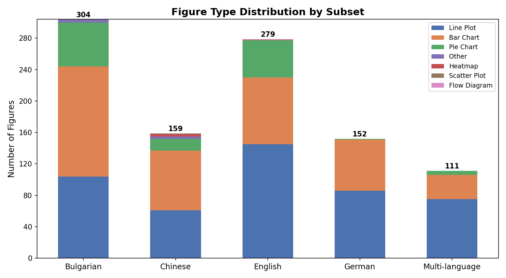
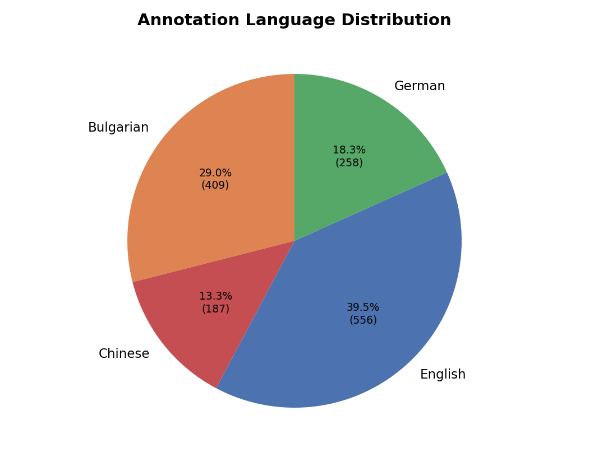
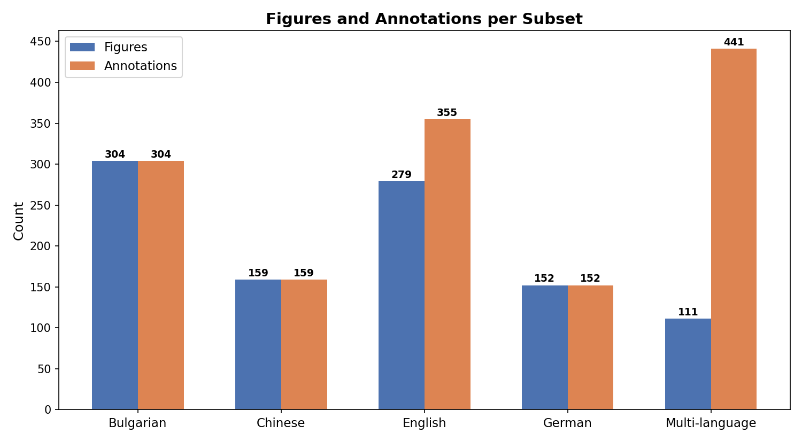
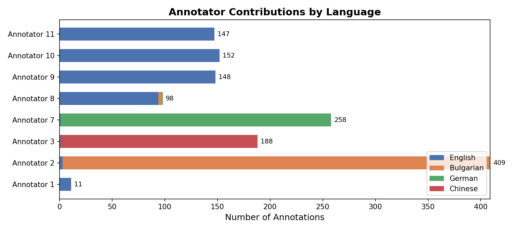
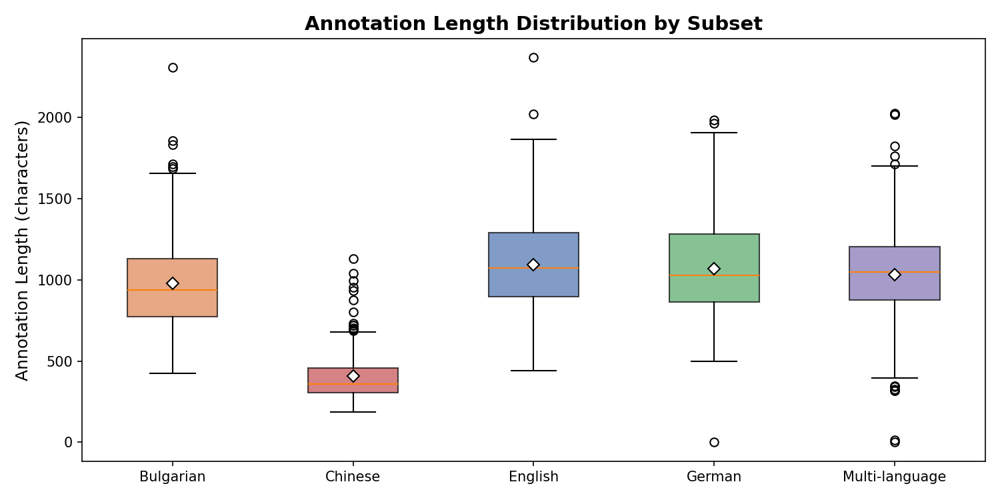

# SciFig Dataset

A multilingual dataset of scientific figure descriptions from arXiv papers, annotated by human annotators in four languages: **English**, **Bulgarian**, **German**, and **Chinese**.

## Overview

| Metric | Value |
|---|---|
| Total figures | 1,005 |
| Total annotations | 1,411 |
| Unique annotators | 8 |
| Unique source papers | 158 |
| Figure types | 7 |
| Annotation languages | 4 |
| Avg. annotation length | ~970 characters |

## Directory Structure

```
Dataset/
├── figures/                  # Figure images (PNG)
│   ├── bulgarian_only/       # 304 figures
│   ├── chinese_only/         # 159 figures
│   ├── english_only/         # 279 figures
│   ├── german_only/          # 152 figures
│   └── multi_language/       # 111 figures
├── groundtruth/              # Annotation JSON files (one per figure)
│   ├── bulgarian_only/       # 304 files
│   ├── chinese_only/         # 159 files
│   ├── english_only/         # 279 files
│   ├── german_only/          # 152 files
│   └── multi_language/       # 111 files
├── distributions/                    # Summary visualizations
└── README.md
```

## Data Format

Each groundtruth JSON file represents a single figure with all its human annotations:

```json
{
  "task_id": 176,
  "arxiv_id": "2505.07293v1",
  "paper_title": "AttentionInfluence Adopting Attention Head Influence for...",
  "paper_language": "English",
  "figure_filename": "082_2505.07293v1_Figure4.png",
  "caption": "The statistics of clustering...",
  "figure_type": "Pie Chart",
  "annotations": [
    {
      "annotation_id": 409,
      "annotated_by": 9,
      "annotation_language": "English",
      "figure_type": "Pie Chart",
      "annotation": "The image features two pie charts comparing..."
    },
    {
      "annotation_id": 438,
      "annotated_by": 11,
      "annotation_language": "English",
      "figure_type": "Flow Diagram",
      "annotation": "The image features two pie charts..."
    }
  ]
}
```

### Field Descriptions

| Field | Description |
|---|---|
| `task_id` | Internal task identifier from the annotation platform |
| `arxiv_id` | arXiv paper identifier (null for some non-arXiv papers) |
| `paper_title` | Title of the source paper |
| `paper_language` | Language of the source paper |
| `figure_filename` | Corresponding image file in `figures/` |
| `caption` | Original figure caption from the paper |
| `figure_type` | Majority-vote figure type across annotators |
| `annotations` | Array of human annotations for this figure |
| `annotations[].annotation_id` | Unique annotation identifier |
| `annotations[].annotated_by` | Annotator identifier |
| `annotations[].annotation_language` | Language the annotation is written in |
| `annotations[].figure_type` | Figure type as labeled by this annotator |
| `annotations[].annotation` | Full-text figure description |

## Subset Descriptions

The dataset is split into five subsets:

| Subset | Figures | Annotations | Annotators | Papers | Description |
|---|---|---|---|---|---|
| `bulgarian_only` | 304 | 304 | 1 | - | Single annotator, Bulgarian annotations |
| `chinese_only` | 159 | 159 | 1 | - | Single annotator, Chinese annotations |
| `english_only` | 279 | 355 | 4 | 121 | Multiple annotators, English annotations |
| `german_only` | 152 | 152 | 1 | 18 | Single annotator, German annotations |
| `multi_language` | 111 | 441 | 8 | 26 | All 8 annotators, all 4 languages |

- **Single-language subsets** (Bulgarian, Chinese, German) each have exactly one annotation per figure.
- **English** has 1--4 annotations per figure (26 figures have a single annotation, 253 have multiple).
- **Multi-language** has 1--9 annotations per figure across all four languages, providing cross-lingual comparisons of the same figures.

## Figure Type Distribution

The dataset covers 7 figure types. The three dominant types are Line Plots, Bar Charts, and Pie Charts.

| Figure Type | Count | Percentage |
|---|---|---|
| Line Plot | 471 | 46.9% |
| Bar Chart | 397 | 39.5% |
| Pie Chart | 124 | 12.3% |
| Other | 7 | 0.7% |
| Heatmap | 3 | 0.3% |
| Scatter Plot | 2 | 0.2% |
| Flow Diagram | 1 | 0.1% |



## Annotation Language Distribution

Annotations are written in four languages. English is the most represented due to the English-only and multi-language subsets.

| Language | Annotations | Percentage |
|---|---|---|
| English | 557 | 39.5% |
| Bulgarian | 409 | 29.0% |
| German | 258 | 18.3% |
| Chinese | 187 | 13.3% |



## Figures and Annotations per Subset

The multi-language subset has the highest annotation density (~4 annotations per figure), while single-language subsets have exactly 1:1 figure-to-annotation ratios.



## Annotator Contributions

Eight annotators contributed to the dataset. Annotators 2, 3, and 7 are primarily monolingual (Bulgarian, Chinese, and German respectively), while annotators 1, 8, 9, 10, and 11 annotated in English.

| Annotator | Annotations | Primary Language(s) |
|---|---|---|
| 2 | 409 | Bulgarian |
| 7 | 258 | German |
| 3 | 188 | Chinese |
| 10 | 152 | English |
| 9 | 148 | English |
| 11 | 147 | English |
| 8 | 98 | English |
| 1 | 11 | English |



## Annotation Length

Average annotation length varies by subset, primarily driven by language characteristics. Chinese annotations are notably shorter (~409 chars) due to the logographic writing system, while English, German, and Bulgarian annotations average ~970--1,090 characters.

| Subset | Avg. Length (chars) |
|---|---|
| English | 1,092 |
| German | 1,069 |
| Multi-language | 1,034 |
| Bulgarian | 979 |
| Chinese | 409 |



## Annotations per Figure

Most figures have a single annotation (868 out of 1,005). Figures with multiple annotations appear in the English and multi-language subsets.

| Annotations per Figure | Number of Figures |
|---|---|
| 1 | 868 |
| 2 | 45 |
| 3 | 16 |
| 4 | 32 |
| 5 | 4 |
| 6 | 29 |
| 7 | 6 |
| 8 | 4 |
| 9 | 1 |
