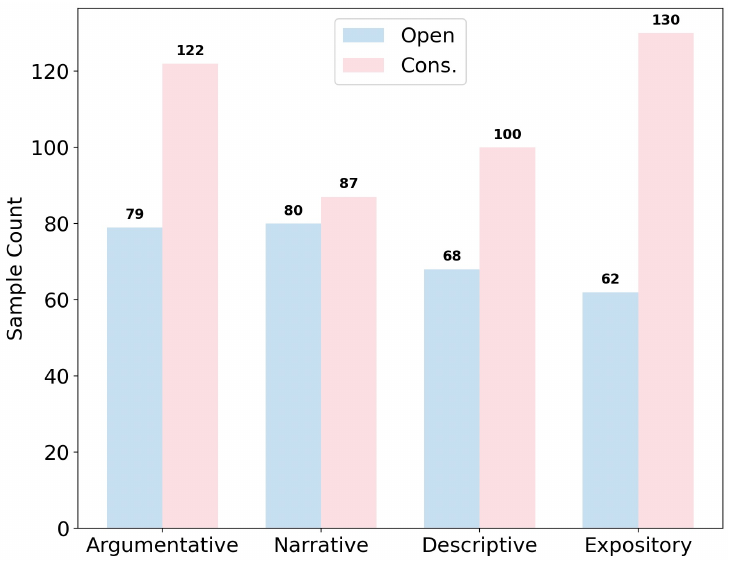
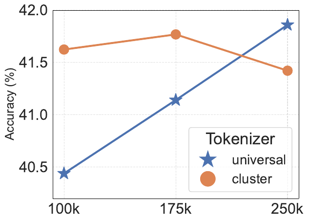
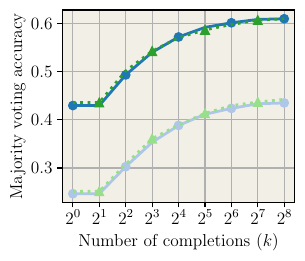

# Groundtruth vs Prompt: Gap Analysis

This document details the divergences between what the annotation prompts ask for and what the human annotators actually produced in the groundtruth. These gaps directly affect LLM evaluation — any model output is scored against human annotations, so understanding what humans actually wrote (vs what they were told to write) is critical.

**Analysis scope:** 1,411 annotations across 1,005 figures in 4 languages.

---

## 1. Paper Context Leakage

**Finding:** 14% of annotations (198 / 1,411) contain information from the paper title that does not appear in the figure caption or the figure itself.

**Why this matters:** The prompts tell annotators to describe "what is shown" in the figure. An LLM given only the image + caption cannot produce paper-context information. If the human gold standard contains it, the model will receive omission errors for information it had no way to know.

### Example: `multi_fig_055` (Bar Chart)

**Paper title:** "EssayBench Evaluating Large Language Models in Multi-Genre Chinese Essay Writing"

**Caption:** "Dataset Statistics. Note that Open denotes Open-Ended sets, Cons. refers to Constrained sets."

**Figure:**

**What the annotator wrote (Annotator 8):**

> "The bar chart illustrates the distribution of samples of **multi-genre Chinese writing** for different text types across two categories..."

The phrase "multi-genre Chinese writing" comes from the paper title. It is not visible anywhere in the figure — the figure shows only "Sample Count" on the y-axis, four text type categories on the x-axis, and "Open"/"Cons." in the legend. An LLM looking at this image would have no way to know this is about "Chinese writing" specifically.

**What an LLM without paper context would produce:**

> "The bar chart illustrates the sample count for different text types across two categories: Open and Cons..."

This is factually correct from the image alone, but would score as an "omission" against the human annotation.

### Example: `english_fig_016` (Line Plot)

**Paper title:** "One Tokenizer To Rule Them All Emergent Language Plasticity via Multilingual Tokenizers"

**Caption:** "Effect of vocabulary size."

**Figure:**

**What the annotator wrote:**

> "The line plot illustrates the comparison of accuracy percentages across different **tokenizers** over a range of data points..."

The word "tokenizer" appears in the figure's legend box ("Tokenizer" heading with "universal" and "cluster" entries), so this is partially visible. However, the annotator's framing of the plot as being about "different tokenizers" draws from knowing the paper context. The caption says only "Effect of vocabulary size" — it does not mention tokenizers. The legend label "Tokenizer" is visible in the figure, but the broader framing comes from paper knowledge.

This is a borderline case: the word is technically visible in the figure, but the annotator's contextual understanding of what the figure is *about* was informed by the paper title.

---

## 2. Interpretation Despite Prohibition

**Finding:** 6.4% of annotations (90 / 1,411) contain interpretive language despite the prompts explicitly saying "Avoid interpreting the cause of changes" and "Do not interpret or explain the results."

The most common offender is the word **"indicating"** (75 occurrences), followed by "significantly" (15), "suggesting" (4).

### Example: `english_fig_006` (Line Plot)

**Paper title:** "Thinking Slow, Fast Scaling Inference Compute with Distilled Reasoners"

**Caption:** "Majority voting."

**Figure:**

**What the annotator wrote (Annotator 9):**

> "...It starts at approximately (1, 0.43) and ends around (256, 0.61), showing a generally increasing trend. The second line is green, features triangle markers, and is a dashed line. This line begins near (1, 0.42) and ends around (256, 0.6), **indicating** a consistent upward trend."

The word "indicating" introduces causal/interpretive framing. "Showing" (used for the first line) is purely descriptive. "Indicating" implies the data is evidence of something — a subtle but real shift from description to interpretation.

**What the prompt asked for:**

> "Avoid interpreting the cause of changes or making comparisons between lines."

If an LLM follows the prompt strictly and writes "ending at approximately 0.6 with an upward trend" (without "indicating"), it would produce text that *doesn't match* the human annotation's phrasing — potentially scoring worse on text similarity metrics even though it's more prompt-compliant.

---

## 3. Prompt Asks for Details Humans Routinely Skipped

The prompts request specific details that human annotators frequently omitted. This creates a paradox: a model that follows the prompt more faithfully than humans would include details absent from the gold standard, which would be flagged as hallucinations.

### Coverage rates for prompt-requested details

**Line Plot annotations (668 total):**

| Prompt requests | % of annotations that include it |
|---|---|
| Specific numerical values | 99.0% |
| Colors | 41.5% |
| Scale type (linear/logarithmic) | 39.5% |
| Axis labels | 37.6% |
| Line style (solid/dashed) | 32.2% |
| Trend descriptions | 31.0% |
| Marker shapes | 26.3% |
| Start/end values | 13.2% |

**Bar Chart annotations (535 total):**

| Prompt requests | % of annotations that include it |
|---|---|
| Numerical values | 96.3% |
| Colors | 37.8% |
| Sorting/order | 33.3% |
| Legend mention | 25.4% |
| Grouping mention | 18.3% |

**Pie Chart annotations (195 total):**

| Prompt requests | % of annotations that include it |
|---|---|
| Percentages | 85.1% |
| Colors | 61.0% |
| Ordering | 56.4% |
| Legend mention | 52.3% |
| Labels on slices | 49.2% |
| Explicit slice count | 11.8% |

### What this means

The prompts ask for axis labels in every line plot description. But 62.4% of human annotations don't mention them. If a model writes "The x-axis is labeled 'Token'" because the prompt told it to, and the human annotation skips that detail entirely, the error analysis would flag the model's statement as a potential hallucination (content with "no counterpart in the gold annotation").

---

## 4. Formulaic Openings

**Finding:** 100% of annotations follow the single-paragraph format. However, 63.7% of English annotations use one of just three opening patterns:

| Opening | Count | % |
|---|---|---|
| "The line plot illustrates the" | 156 | 28.0% |
| "The bar chart illustrates the" | 150 | 26.9% |
| "The pie chart represents the" | 49 | 8.8% |
| "The plot illustrates the relationship" | 32 | 5.7% |
| "The pie chart illustrates the" | 23 | 4.1% |

This suggests human annotators converged on a template, likely from training examples or shared instructions. The prompt does not mandate this phrasing. An LLM that begins with different (but equally valid) phrasing like "This figure shows..." would diverge from the gold standard pattern, potentially lowering similarity scores.

---

## 5. Summary of Gaps

| Gap | Scope | Impact on LLM Evaluation |
|---|---|---|
| Paper context in annotations | 14% of annotations | Model cannot reproduce without paper_title; scored as omissions |
| Interpretation in annotations | 6.4% of annotations | Strict models penalized for being *more* prompt-compliant |
| Under-reported details | 60-87% miss rate for some details | Over-compliant models penalized as hallucinations |
| Formulaic openings | 63.7% use 3 patterns | Different phrasing lowers similarity metrics |

---

## 6. Implications for LLM Generation

1. **Pass `paper_title` alongside the caption** to give the model access to the same context humans had. Without it, 14% of annotations contain information the model cannot possibly produce.

2. **Do not expect prompt-perfect compliance** — the ground truth was shaped by human behavior, not prompt specifications. A model that matches human annotation style will score better than one that follows the prompt to the letter.

3. **Evaluation metrics should account for these gaps** — pure text similarity (BLEU, ROUGE) will penalize valid descriptions that use different phrasing. The structured error analysis (8 error types) is more robust but still uses human annotations as the gold standard.

4. **Consider whether to update prompts** — the current prompts set a higher bar than humans met. This is not necessarily bad (it guides the model to be thorough), but we should be aware that the evaluation gold standard doesn't reflect that bar.
