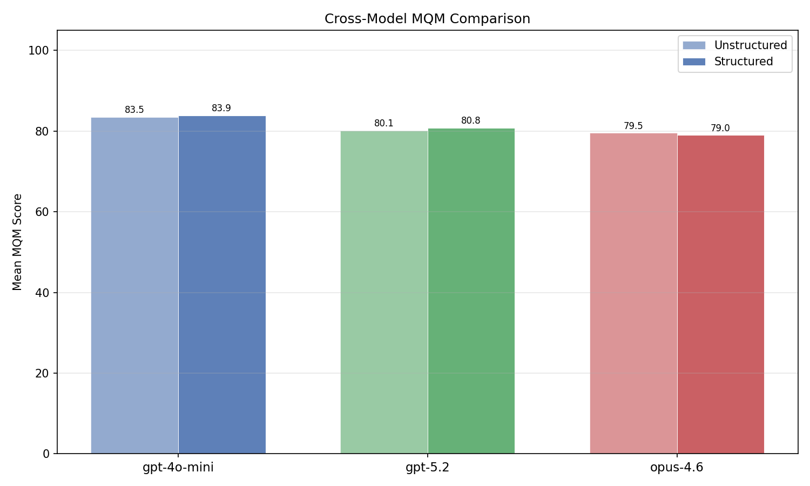
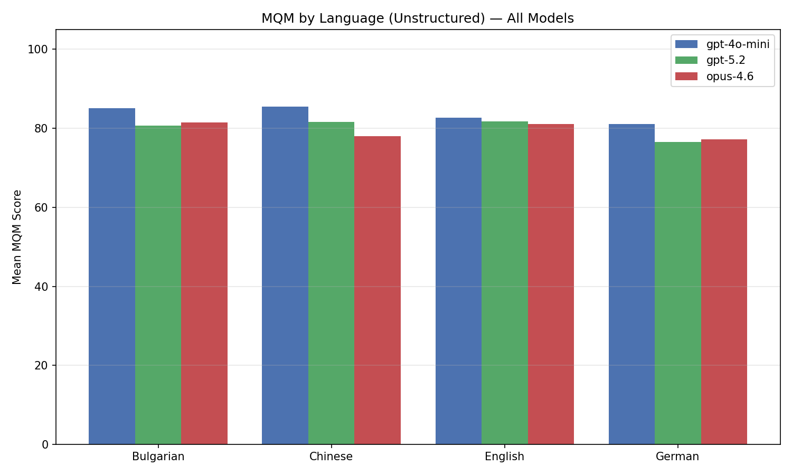
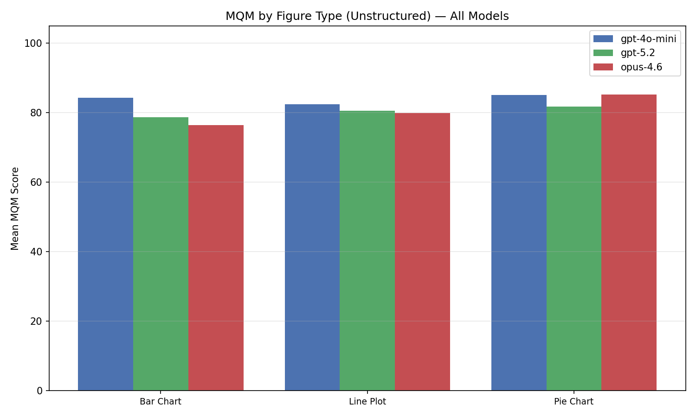
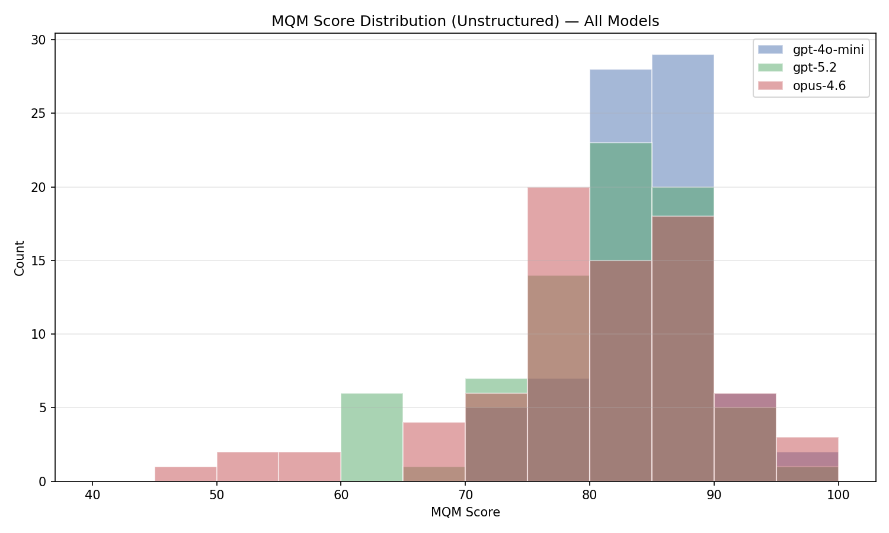
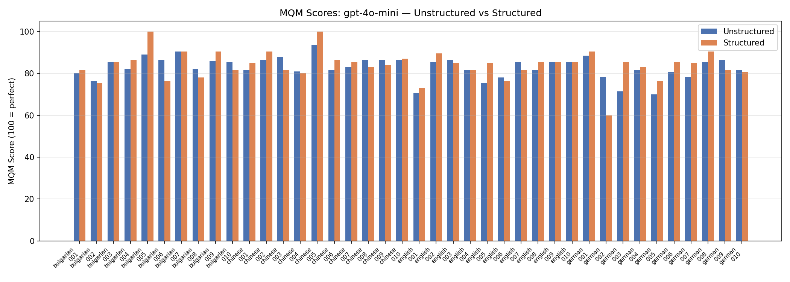
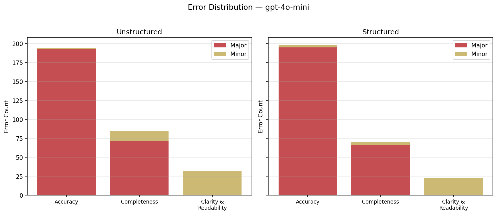
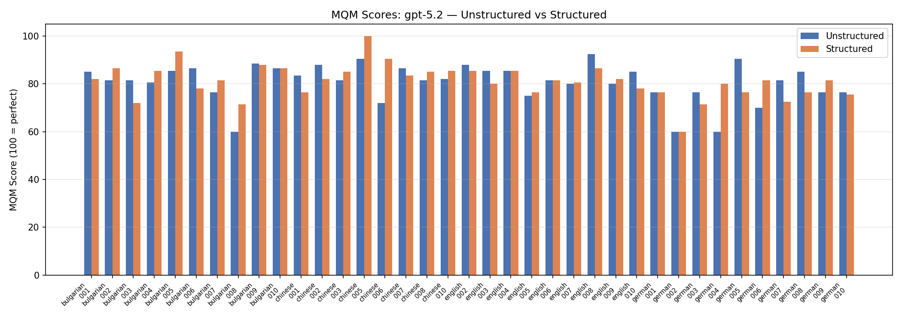
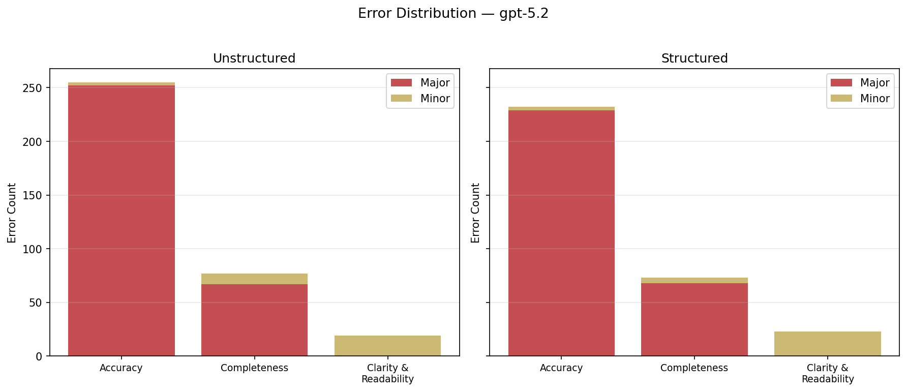
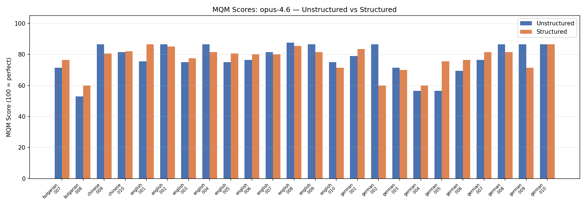
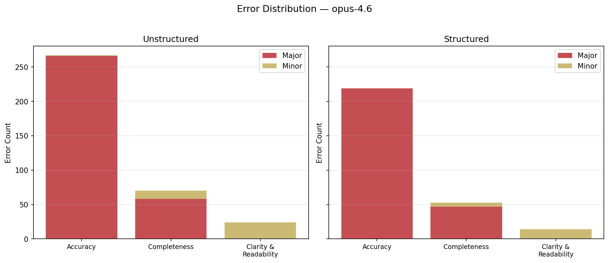

# Evaluation Summary — Multi-Model Comparison

> MQM-based evaluation of 3 models on 50 sample figures
> Models: **gpt-4o-mini**, **gpt-5.2**, **opus-4.6**
> 
> - **Unstructured**: paragraph-only descriptions
> - **Structured**: paragraph + component breakdown (paragraph MQM for fair comparison)

## Cross-Model Overview

| Metric |gpt-4o-mini (U) | gpt-4o-mini (S) | gpt-5.2 (U) | gpt-5.2 (S) | opus-4.6 (U) | opus-4.6 (S) |
|---|---|---|---|---|---|---|
| Evaluations | 77 | 77 | 77 | 74 | 77 | 61 |
| MQM Mean | 83.5 | 83.9 | 80.1 | 80.8 | 79.5 | 79.0 |
| MQM Median | 83.5 | 85.0 | 81.5 | 81.5 | 81.5 | 80.0 |
| MQM Std Dev | 5.4 | 6.5 | 8.0 | 8.1 | 10.1 | 8.9 |
| MQM Min | 70.0 | 60.0 | 60.0 | 43.0 | 48.5 | 60.0 |
| MQM Max | 100.0 | 100.0 | 100.0 | 100.0 | 100.0 | 100.0 |
| Avg Errors/Fig | 4.0 | 3.8 | 4.6 | 4.4 | 4.7 | 4.7 |
| Total Errors | 311 | 291 | 351 | 328 | 364 | 286 |
| Avg Penalty | 16.5 | 16.1 | 19.9 | 19.2 | 20.5 | 21.0 |

## MQM by Language — All Models

| Language |gpt-4o-mini | gpt-5.2 | opus-4.6 |
|---|---|---|---|
| Bulgarian | 85.1 | 80.7 | 81.5 |
| Chinese | 85.5 | 81.6 | 78.1 |
| English | 82.7 | 81.8 | 81.1 |
| German | 81.1 | 76.5 | 77.2 |

## MQM by Figure Type — All Models

| Figure Type |gpt-4o-mini | gpt-5.2 | opus-4.6 |
|---|---|---|---|
| Bar Chart | 84.3 | 78.7 | 76.5 |
| Line Plot | 82.4 | 80.6 | 80.0 |
| Pie Chart | 85.2 | 81.8 | 85.3 |

## Score Distribution — All Models

---

## Model: gpt-4o-mini

### Unstructured vs Structured

| Metric | Unstructured | Structured |
|---|---|---|
| Evaluations | 77 | 77 |
| MQM Mean | 83.5 | 83.9 |
| MQM Median | 83.5 | 85.0 |
| MQM Std Dev | 5.4 | 6.5 |
| Avg Errors/Figure | 4.0 | 3.8 |
| Total Errors | 311 | 291 |
| Breakdown Completeness | — | 100% |
| Count Consistency | — | 86% |

### Error Distribution

| Category | Severity | Unstructured | Structured |
|---|---|---|---|
| Accuracy | Major | 193 | 195 |
| Accuracy | Minor | 1 | 3 |
| Completeness | Major | 72 | 66 |
| Completeness | Minor | 13 | 4 |
| Clarity and Readability | Major | 0 | 0 |
| Clarity and Readability | Minor | 32 | 23 |

---

## Model: gpt-5.2

### Unstructured vs Structured

| Metric | Unstructured | Structured |
|---|---|---|
| Evaluations | 77 | 74 |
| MQM Mean | 80.1 | 80.8 |
| MQM Median | 81.5 | 81.5 |
| MQM Std Dev | 8.0 | 8.1 |
| Avg Errors/Figure | 4.6 | 4.4 |
| Total Errors | 351 | 328 |
| Breakdown Completeness | — | 100% |
| Count Consistency | — | 100% |

### Error Distribution

| Category | Severity | Unstructured | Structured |
|---|---|---|---|
| Accuracy | Major | 252 | 229 |
| Accuracy | Minor | 3 | 3 |
| Completeness | Major | 67 | 68 |
| Completeness | Minor | 10 | 5 |
| Clarity and Readability | Major | 0 | 0 |
| Clarity and Readability | Minor | 19 | 23 |

---

## Model: opus-4.6

### Unstructured vs Structured

| Metric | Unstructured | Structured |
|---|---|---|
| Evaluations | 77 | 61 |
| MQM Mean | 79.5 | 79.0 |
| MQM Median | 81.5 | 80.0 |
| MQM Std Dev | 10.1 | 8.9 |
| Avg Errors/Figure | 4.7 | 4.7 |
| Total Errors | 364 | 286 |
| Breakdown Completeness | — | 100% |
| Count Consistency | — | 100% |

### Error Distribution

| Category | Severity | Unstructured | Structured |
|---|---|---|---|
| Accuracy | Major | 266 | 219 |
| Accuracy | Minor | 1 | 0 |
| Completeness | Major | 58 | 47 |
| Completeness | Minor | 12 | 6 |
| Clarity and Readability | Major | 0 | 0 |
| Clarity and Readability | Minor | 24 | 14 |

---

## Scoring Methodology

MQM Score = max(0, 100 - total_penalty)

| Error Category | Major Weight | Minor Weight |
|---|---|---|
| Accuracy | 5.0 | 2.0 |
| Completeness | 3.5 | 1.5 |
| Clarity and Readability | 2.0 | 1.0 |

- **100** = error-free description
- **0** = penalties exceed 100 points
- Judge model: `gpt-4o-mini` via OpenRouter
- Sample: 50 figures (10 per language folder), 3 models
