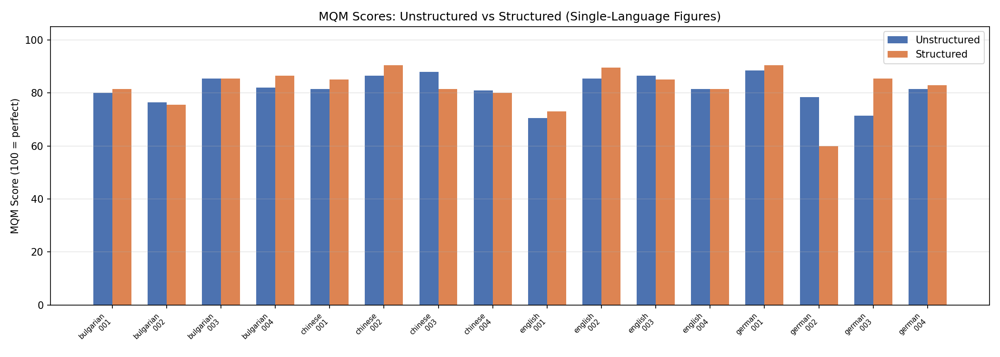
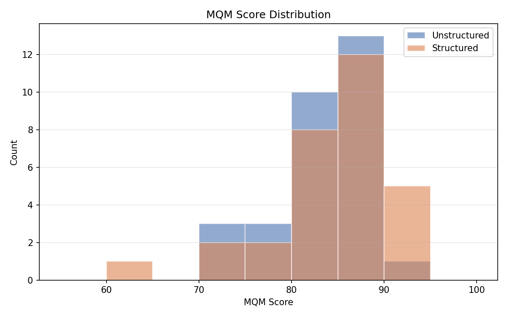
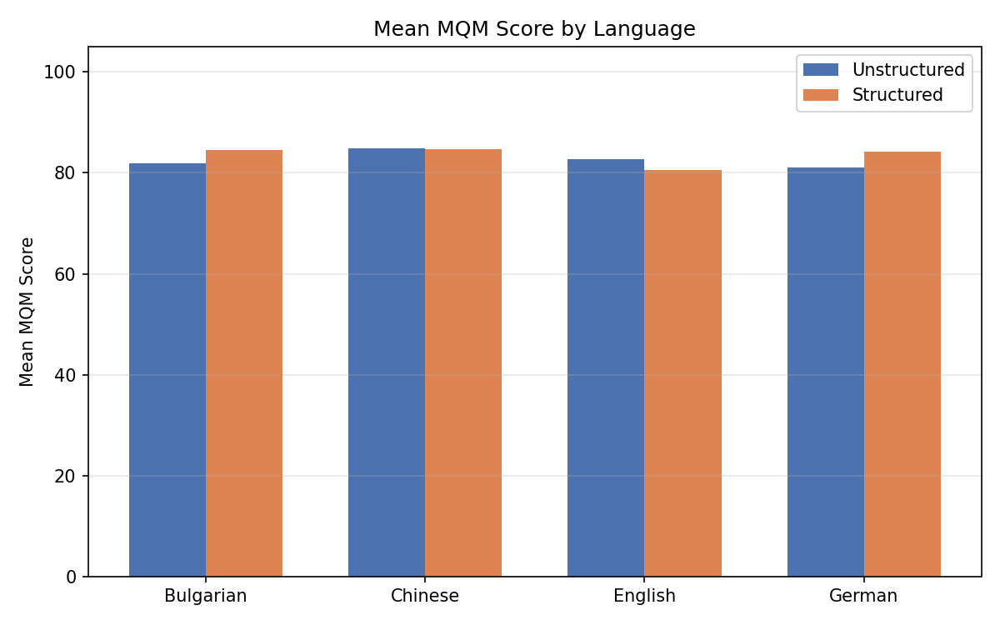
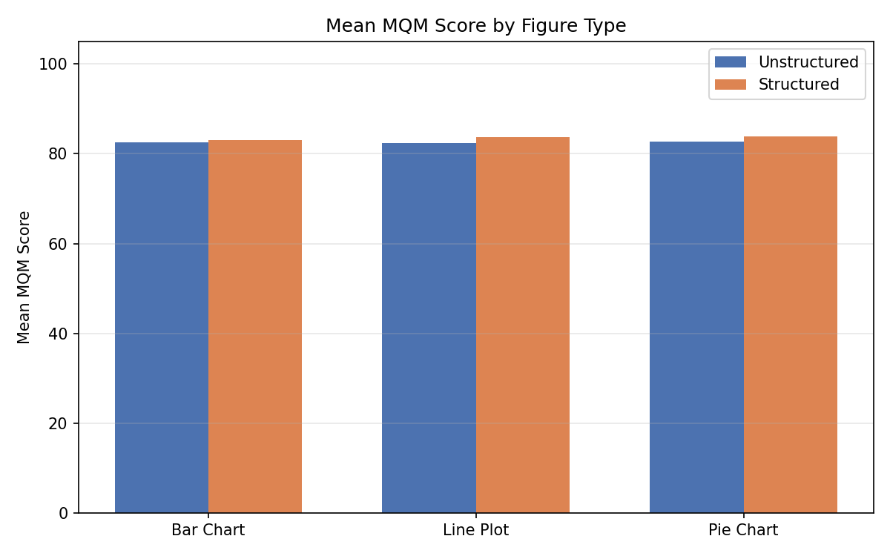
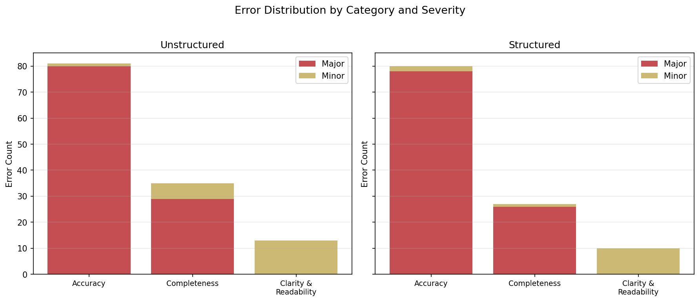
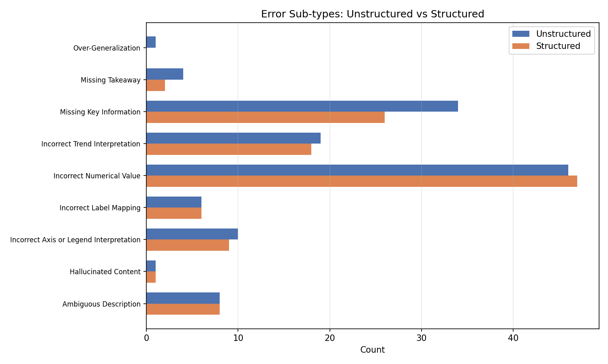

# Sample Evaluation Summary

> MQM-based evaluation of GPT-4o-mini figure annotations (20 sample figures)
> 
> - **Unstructured**: paragraph-only descriptions
> - **Structured**: paragraph + component breakdown (Option C: paragraph MQM for fair comparison)

## Overview

| Metric | Unstructured | Structured |
|---|---|---|
| Evaluations | 30 | 30 |
| MQM Mean | 82.5 | 83.5 |
| MQM Median | 83.2 | 85.0 |
| MQM Std Dev | 5.0 | 6.8 |
| MQM Min | 70.5 | 60.0 |
| MQM Max | 90.5 | 94.0 |
| Avg Errors/Figure | 4.3 | 3.9 |
| Total Errors | 129 | 117 |
| Avg Penalty | 17.5 | 16.6 |
| Breakdown Field Completeness | — | 100% |
| Breakdown Count Consistency | — | 83% |

## MQM Score Comparison

## Per-Figure Results

### Single-Language Figures

| Figure | Type | Unstruct MQM | Unstruct Errors | Struct MQM | Struct Errors | Breakdown |
|---|---|---|---|---|---|---|
| bulgarian_fig_001 | Line Plot | 80.0 | 5 | 81.5 | 4 | 100% |
| bulgarian_fig_002 | Line Plot | 76.5 | 5 | 75.5 | 6 | 100% |
| bulgarian_fig_003 | Line Plot | 85.5 | 4 | 85.5 | 4 | 100% |
| bulgarian_fig_004 | Pie Chart | 82.0 | 5 | 86.5 | 3 | 100% |
| chinese_fig_001 | Line Plot | 81.5 | 4 | 85.0 | 3 | 100% |
| chinese_fig_002 | Line Plot | 86.5 | 3 | 90.5 | 3 | 100% |
| chinese_fig_003 | Line Plot | 88.0 | 3 | 81.5 | 4 | 100% |
| chinese_fig_004 | Bar Chart | 81.0 | 6 | 80.0 | 4 | 100% |
| english_fig_001 | Pie Chart | 70.5 | 7 | 73.0 | 6 | 100% |
| english_fig_002 | Pie Chart | 85.5 | 4 | 89.5 | 3 | 100% |
| english_fig_003 | Line Plot | 86.5 | 3 | 85.0 | 3 | 100% |
| english_fig_004 | Line Plot | 81.5 | 4 | 81.5 | 4 | 100% |
| german_fig_001 | Line Plot | 88.5 | 3 | 90.5 | 3 | 100% |
| german_fig_002 | Bar Chart | 78.5 | 5 | 60.0 | 8 | 100% |
| german_fig_003 | Bar Chart | 71.5 | 6 | 85.5 | 4 | 100% |
| german_fig_004 | Bar Chart | 81.5 | 4 | 83.0 | 4 | 100% |

### Multi-Language Figures

| Figure | Language | Unstruct MQM | Unstruct Errors | Struct MQM | Struct Errors |
|---|---|---|---|---|---|
| multi_fig_001 | Bulgarian | 75.0 | 5 | 85.0 | 3 |
| multi_fig_001 | Chinese | 81.5 | 4 | 86.5 | 3 |
| multi_fig_001 | English | 85.5 | 4 | 73.0 | 6 |
| multi_fig_001 | German | 73.5 | 6 | 86.5 | 3 |
| multi_fig_002 | Bulgarian | 85.5 | 4 | 91.5 | 2 |
| multi_fig_002 | Chinese | 90.5 | 3 | 85.0 | 3 |
| multi_fig_002 | English | 83.5 | 4 | 85.5 | 4 |
| multi_fig_002 | German | 86.5 | 3 | 94.0 | 2 |
| multi_fig_003 | Bulgarian | 85.5 | 5 | 83.0 | 4 |
| multi_fig_003 | English | 83.0 | 4 | 81.5 | 4 |
| multi_fig_003 | German | 81.5 | 4 | 84.0 | 5 |
| multi_fig_004 | Bulgarian | 85.5 | 4 | 88.0 | 3 |
| multi_fig_004 | English | 86.0 | 5 | 75.5 | 6 |
| multi_fig_004 | German | 86.5 | 3 | 90.5 | 3 |

## Score Distribution

## MQM by Language

| Language | Unstruct Mean | Struct Mean |
|---|---|---|
| Bulgarian | 81.9 | 84.6 |
| Chinese | 84.8 | 84.8 |
| English | 82.8 | 80.6 |
| German | 81.0 | 84.2 |

## MQM by Figure Type

| Figure Type | Unstruct Mean | Struct Mean |
|---|---|---|
| Bar Chart | 82.6 | 83.0 |
| Line Plot | 82.3 | 83.7 |
| Pie Chart | 82.7 | 83.8 |

## Error Analysis

### Error Counts by Category and Severity

| Category | Severity | Unstructured | Structured |
|---|---|---|---|
| Accuracy | Major | 80 | 78 |
| Accuracy | Minor | 1 | 2 |
| Completeness | Major | 29 | 26 |
| Completeness | Minor | 6 | 1 |
| Clarity and Readability | Major | 0 | 0 |
| Clarity and Readability | Minor | 13 | 10 |

### Error Sub-types

| Sub-type | Unstructured | Structured |
|---|---|---|
| Incorrect Numerical Value | 46 | 47 |
| Missing Key Information | 34 | 26 |
| Incorrect Trend Interpretation | 19 | 18 |
| Incorrect Axis or Legend Interpretation | 10 | 9 |
| Ambiguous Description | 8 | 8 |
| Incorrect Label Mapping | 6 | 6 |
| Missing Takeaway | 4 | 2 |
| Hallucinated Content | 1 | 1 |
| Over-Generalization | 1 | 0 |

## Scoring Methodology

MQM Score = max(0, 100 - total_penalty)

| Error Category | Major Weight | Minor Weight |
|---|---|---|
| Accuracy | 5.0 | 2.0 |
| Completeness | 3.5 | 1.5 |
| Clarity and Readability | 2.0 | 1.0 |

- **100** = error-free description
- **0** = penalties exceed 100 points
- Judge model: `gpt-4o-mini` via OpenRouter
- Sample: 20 figures (4 per language folder), 20 single-language + multi-language per-language evaluations
